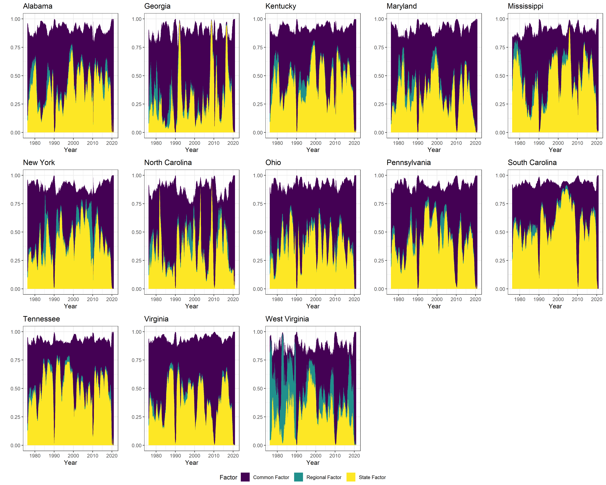
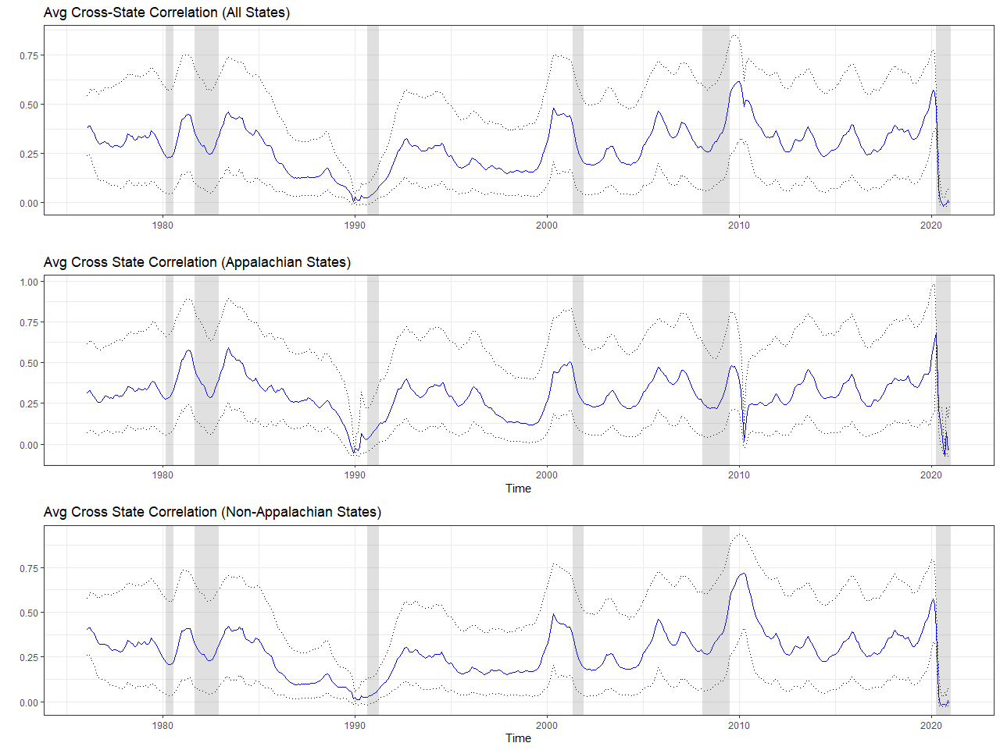
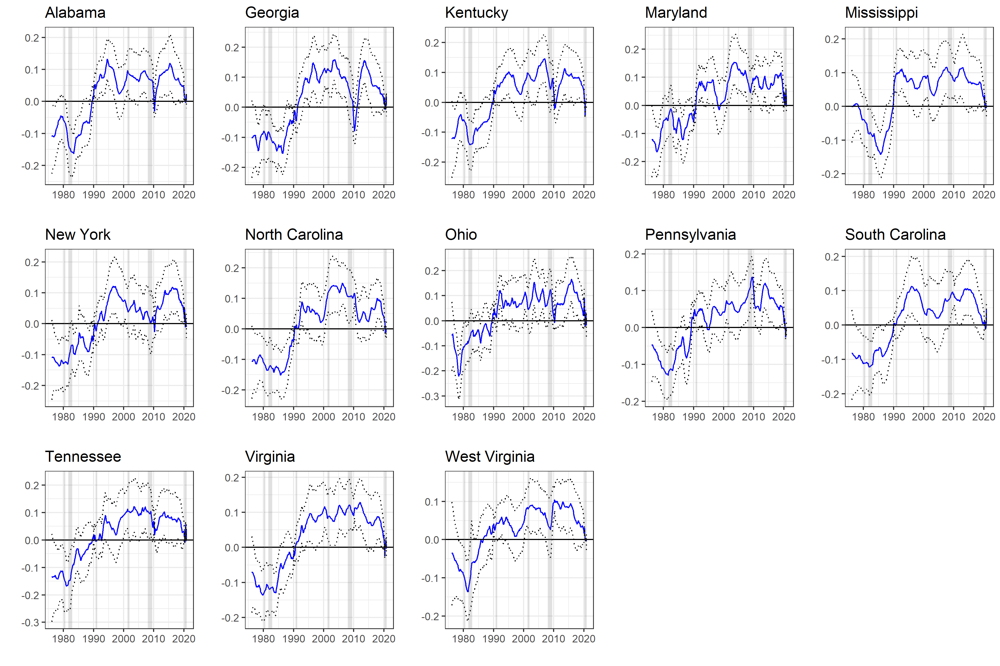

To read this paper: [click here!](https://ageconsearch.umn.edu/record/322258/files/22918.pdf)

## Summary
The effects of labor market shocks often vary across and within geographical regions but little work has been done on the intertemporal dynamics of U.S. state-wide and regional labor force participation rates.  Labor force participation rates in the Appalachian Region are particularly interesting because:

1. Academic literature documents a unique relationsbhip between the labor force participation rate (LFPR) the Appalachian Region.

2. Given persistent economic disparity and poverty in the region, there is large potential gains in economic growth for Appalachia and subsequently the rest of the U.S. with improvements in this region. 

3. Appalachian Region counties are apart of U.S. states that make up 31% of U.S. gross domestic product (GDP)

Figure 1: The Appalachian Region

In this project, we examine the role and relative importance of geographic levels themselves on the change in state labor force participation rates. We decompose state LFPR into national (also referred to as a common component), regional (Appalachia or non-Appalachia), and state-specific (idiosyncratic) latent factors estimated using a Dynamic Factor Model (DFM) with time-varying (TV) and stochastic volatility (SV) components. 

Figure 2: Regionally Aggregated State Level Percent Contribution to National GDP

We assume that changes in state LFPR are described by these factors which capture national, regional, and state comovements. By calculating the correlation of LFPR in each U.S. state in each time period with these factors, we are able to determine the role and relative importance each contributes to changing LFPRs under different economic shocks and trends. To do this, we use monthly labor force participation rates for the 50 U.S. states and Washington D.C. over the period January 1976 - December 2020.

Figure 3: Change in (Selected) U.S. State Labor Force Participation Rates

## Results 

We find substantial variation in state LFPR comovement over time, geographic level, and during different macroeconomic situations. We find that the choice of time and state is crucial to the relative importance of the level of synchronization on observed change in LFPR variations. For example, around 97\% of the variation in the LFPR in West Virginia is explained by the Appalachian regional factor in 1982, but less than 1\% of the variation is explained by this same factor in 2010.

Figure 4: Variance Contribution of Factor by State in the Appalachian Region

Additionally, the West Virginia LFPR is strongly connected with the synchronization of LFPR in the Appalachian region for periods coinciding with regional labor market shocks such as the coal boom (1970s) and bust (1980s).

Figure 5: Average Cross State Correlation

We also find that in the last three decades there has been an increase in synchronization of state LFPR with the national factor. Yet, divergence occurs in this trend of synchronization with the national factor during periods of national recessions, regional labor market shocks or restructuring, and state labor shocks like natural disasters. 

Figure 6: National Factor Loadings of Appalachian States

## Policy Recommendations
Labor market policies that are broader or more national in scope may be appropriate during business-cycle expansions as they would take advantage of the increased synchronization of LFPR. These broad policies would potentially induce employment and GDP growth for both struggling and prospering areas alike. In contrast, during periods of divergence in state LFPR (like recessions) more localized and targeted labor policies would be more efficient. In other words, targeting less aggregated geographic levels when LFPR changes are heterogeneous across states could induce employment and GDP growth for struggling areas without the risk of unintended effects from ``one-size fits all'' policies.

