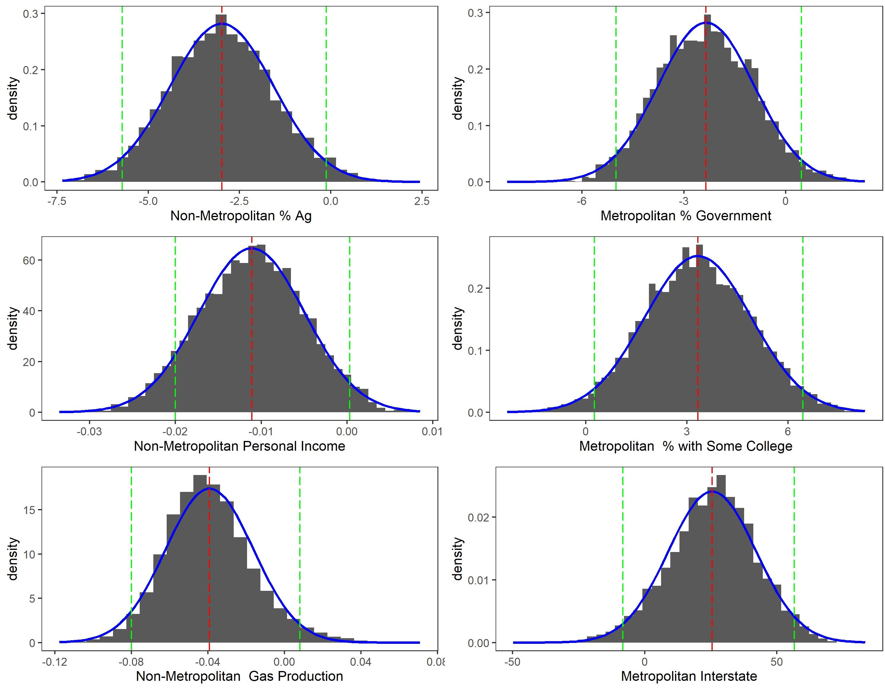

```{r setup2, include=FALSE}
knitr::opts_chunk$set(echo = TRUE)
```

## Summary
The decline of the U.S. labor force participation rate (LFPR) in recent years has sparked a growing interest in various aspects of labor force participation (LFP) as an indicator for future employment and economic growth. One such topic regards spatial differences in LFPRs. Differences, especially across the urban/rural divide, have been found in various countries and across demographic subgroups including women and poor households. 

However, measuring the degree of synchronicity of LFPRs within and across urban and rural areas has received relatively little attention in the literature. This is regrettable since labor force participation (LFP) decisions synchronized across counties may impact local labor markets and contribute to persistent labor market distress. The stronger the linkages between areas, the greater the impact labor market shocks will have on the larger economy. These compounded effects imply potential obstacles to overcome in increasing labor force participation and realizing labor and economic growth in rural and distressed areas of the U.S.

In this project, we focus on the relatively rural and economically distressed state of West Virginia for a couple of reasons:

1. Not only is West Virginia economically distressed, but the economic disparity compared to the rest of the U.S. has persisted for decades.

2. While the inequality around skills, income, and other indicators in West Virginia have not gone unnoticed by policymakers or the media, labor force participation in the state has received relatively little attention by economists

## Stage 1

In the first stage of this study, we examine the role and relative importance of state, county, and metropolitan/non-metropolitan influences on the change in West Virginia county LFPRs. We decompose West Virginia county LFPRs into latent factors that measure comovement at these levels. The state, county, and metropolitan and non-metropolitan factors are estimated using a Dynamic Factor Model (DFM) with time-varying (TV) and stochastic volatility (SV) parameters.

To do this we use labor force and population data over 1990-2020 from the BLS and the U.S. Census Bureau,
respectively. These are used to calculate labor force participation rates for West Virginia counties which we classify as metropolitan or non-metropolitan. We use USDA Rural-Urban Continuum Codes to classify each county.

```{r p2pic, echo=FALSE, fig.align='center', out.width='90%', fig.cap='Change in Labor Force Participation Rates by RUCC Status'}


```

## Stage 1 Results
In our two-stage analysis, we first find that in recent years a common state-wide component has influenced change in West Virginia county LFPRs, signaling a synchronization of county labor markets. This makes West Virginia counties and the state overall more vulnerable to broad labor market shocks.

```{r p2pic2, echo=FALSE, fig.align='center', out.width='90%', fig.cap='Average RUCC Factor Laodings by RUCC Status'}


```

We also find that non-metropolitan county LFPRs are persistently correlated with the collective movements of non-metropolitan LFPRs over time. This, again, implies a vulnerability for non-metropolitan counties to shocks, but also provides an opportunity to target many counties simultaneously with non-metropolitan specific policy, given that these areas are known to have lower LFPRs and poorer economic activity.

```{r p2pic3, echo=FALSE, fig.align='center', out.width='90%', fig.cap='Average RUCC Factor Loadings by RUCC Status'}

knitr::include_graphics("regional_loadingsr.png")

```

However, we also find evidence of idiosyncratic behavior across the state as well. About 57\% and 65\% of the variation in change in metropolitan and non-metropolitan county LFPRs is explained by county-specific components, respectively. This calls for targeting labor and economic issues more individually across the state rather than implementing state-wide ``one-size-fits-all" solutions.

```{r p2pic4, echo=FALSE, fig.align='center', out.width='90%', fig.cap='Average Variance Contribution by Factor in West Virginia Over Time'}


```


```{r p2pic5, echo=FALSE, fig.align='center', out.width='90%', fig.cap='Variance Contribution by Factor in West Virginia'}

knitr::include_graphics("metroVnonmetr_var_decomp.png")

```

## Stage 2
In the second stage of the study, we investigate these percentages further by regressing these percent contributions of the factors to LFPR variations on county characteristics such as demographics, industry composition, life expectancy, etc. This part of the analysis allows us to determine which county characteristics best explain a county's sensitivity to state and metropolitan/non-metropolitan influences on LFPRs and through which channels LFPRs can be increased. County characteristics that we include in our study are as follows:

1. Percent of Industry in Government Jobs
2. Percent of Industry in Agricultural Jobs
3. Percent of Industry in Manufacturing Jobs
4. Percent of Industry in Mining Jobs
5. Percent of Industry in Non-Farm Jobs
6. Personal Income
7. Unemployment Rate
8. Life Expectancy
9. Percent of Population that is African American
10. Percent of Population that is Female Less than 25 Years of Age
11. Percent of Population that is Female between 25 and 54
12. Percent of Population that is Female between 54 and 65
13. Percent of Population that another race
14. Percent of Population above 25 years of age with a High School Diploma
15. Percent of Population above 25 years of age with Some College
16. County Land Area
17. Percent of Families with related children who receive public assistance under the Temporary Aid to Needy Families (TANF)
18. Precipitation 
19. Gas Production
20. Number of Gas Wells
21. Coal Production
22. Has an Interstate

## Second Stage Results

 Lastly, we find that county demographics, education levels, income, access to interstate highways, and industry composition are strongly related to the importance of our estimated state, county, and metropolitan and non-metropolitan factors. Figure 6 shows that zero lies outside of the 95\% HPDI indicating we can be 95\% sure that increases in personal income positively impact the influence of the state factor in LFPR changes over time. Figure 6 also shows negative links exist between the importance of the state factor in explaining change in LFPR variations and the unemployment rate, share of the population that is female below the age of 25, share of population 25 or older that has some college, the number of gas wells, share of families with children that are receiving TANF, and the existence of an interstate.
 
```{r p2pic6, echo=FALSE, fig.align='center', out.width='90%', fig.cap='Variance Contribution by Factor in West Virginia'}


```

Figure 7 shows that zero lies outside the 95\% HPDI for agriculture and education and close to outside the bands for natural gas production. 

```{r p2pic7, echo=FALSE, fig.align='center', out.width='90%', fig.cap='Variance Contribution by Factor in West Virginia'}



```

Figure 8 shows that zero is just about outside of the 95\% HDPI, indicating strong certainty of negative relationship. 

```{r p2pic8, echo=FALSE, fig.align='center', out.width='90%', fig.cap='Variance Contribution by Factor in West Virginia'}


```

Summarizing our findings, we first find the correlation between metropolitan and non-metropolitan county LFPR series and the state factor to be near-zero for most periods in the sample. Near the end of the sample, the metropolitan counties followed by the non-metropolitan counties show positive correlations with the state factor indicating recent influence on the county LFPRs by a common state trend and increased synchronization of county LFPRs across the state. We also find positive correlation between the non-metropolitan factor and non-metropolitan counties for most periods in the sample which indicates a strong and persistent non-metropolitan trend. While the correlation between metropolitan counties and the metropolitan factor are near-zero for most of the sample period, we find positive correlation following the 2008-09 recession indicating a unique metropolitan influence induced by the severity of the Great Recession.

Secondly, this study determines the relative importance of the factors by measuring the contribution of each factor to county LFPR variations. We find that the county factor dominates in contributing to county LFPR variations indicating significant idiosyncratic behavior across the state. Additionally, we find relatively large contribution of the non-metropolitan factor indicating noticeable rural or non-metropolitan behavior as well. Regressing these variance contributions on county characteristics reveals main drivers for the importance of each factor. County demographics, education levels, income, access to interstate highways, and industry composition are strongly related to the importance of our estimated state, county, and metropolitan and non-metropolitan factors. Larger positive increases in LFPRs are associated with increases in education, infrastructure, and industry.
## Policy Recommendations

For non-metropolitan counties specifically, policymakers should focus on formalizing informal/nonstandard work, and increasing wage income, employment opportunities, and work force development programs. For West Virginia in general, policymakers should work to support and diversify key industries in West Virginia through building infrastructure, creating accessibility, and developing a healthy, well educated, and well trained work force. A united front and a targeted focus on programs that build on the State’s unique assets and capitalize on industries such as manufacturing and gas, where West Virginia outperforms its neighboring states, provides a unique opportunity to increase jobs, infrastructure, wages, and attract potential businesses.


